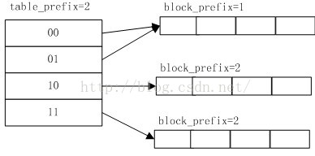
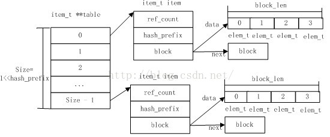

## 红黑树的特点以及常见的二叉平衡树

红黑树性能比较高，插入删除时间复杂度保持在logn。和AVL相比，要求不是那么严格，它只要求到叶节点的最长路径不超过最短路径的两倍。相比之下，AVL要求左右子树相差高度不超过一，简单的插入或者删除都会导致树的不平衡需要旋转操作。

**红黑树的特性**:
**（1）每个节点或者是黑色，或者是红色。**
**（2）根节点是黑色。**
**（3）每个叶子节点（NIL）是黑色。 [注意：这里叶子节点，是指为空(NIL或NULL)的叶子节点！]**
**（4）如果一个节点是红色的，则它的子节点必须是黑色的。**
**（5）从一个节点到该节点的子孙节点的所有路径上包含相同数目的黑节点。**

[面试题——轻松搞定面试中的红黑树问题 - Jessica程序猿 - 博客园 (cnblogs.com)](https://www.cnblogs.com/wuchanming/p/4444961.html)

## 跳表与b+树

## 快排何时退化

如果选择最左边或者最右边为枢纽，那么如果是倒序的就可能会发生快排的退化

## 快排的优化方法

1. 当整个序列有序时退出算法
2. 分割成两个序列时，只对其中一个递归进去，另一个序列仍可以在这一函数内继续划分，可以显著减小栈的大小（尾递归）
3. 选定一个 k，当序列长度小于 k 时，[sort 函数](https://www.zhihu.com/search?q=sort+函数&search_source=Entity&hybrid_search_source=Entity&hybrid_search_extra={"sourceType"%3A"answer"%2C"sourceId"%3A20110508})直接不作处理返回原序列。

## 哈希算法

1. cuckoo-hash

   Use multiple hash tables with different hash  function seeds

2. Robin-hood

   用于解决线性探测导致的探测次数不均匀问题，每一个项额外记录一个val，保存该项的探测次数

3. 线性哈希

   m < B, 则存入bucket中；如果B <= m < $2^i$，那么存入m - $2^i$ - 1

4. 可扩展哈希

   

   

## wait-free

1. obstruction-free: if a thread can perform an arbitrary operation on the object in a finite number of steps when it executes in isolation.
2. lock-free: if some thread performing an arbitrary operation on the object will complete in a finite number of steps
3. wait-free: if every thread can perform an arbitrary operation on the object in a finite number of steps

