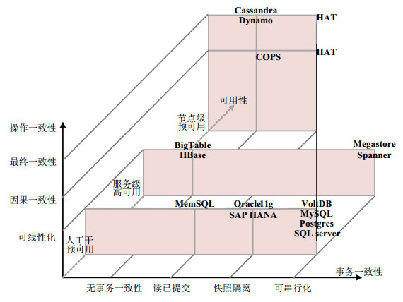

# Raft && Paxos

1. Strong Leader
2. Leader Election
3. Membership Changes

## 为什么要有multi-paxos?

答: Paxos仅能完成单个的decision，需要multi-paxos来实现log

## 何为consensus?

consensus algorithms allow a collection of machines to work as a coherent group that can **survive the failures of its members**.

## Paxos的问题

1. 难以理解
2. no widely agreed-upon algorithm for multi-Paxos(no details of publication)
3. poor one for building practical systems, simpler to design a system around a log, where new entries are appended sequentially in a constrained order

## raft算法

raft是强leader(由leader确保可否进行log的复制，接受请求，复制到其他节点的server等操作)。由于强leader，Raft将

# 高可用

1. 节点级高可用(一般为弱一致性的系统提供Cassandra, Dynamo)

   换言之, 节点级高可用能够容忍节点故障和分区故障.当发生部分节点故障或者链路故障后, 节点级高可用要求系统中所有剩余的存活节点依然能够提供服务.

2. 服务级高可用

   当出现网络分区后, 只要分区的严重程度有限(比如某个分区中存在多数派), 那么整个系统依然可以继续对外提供服务.

3. 人工介入后高可用

   当出现网络分区后, 系统暂时不可对外服务, 只有在人工介入确认系统状态或采取某种补救措施后, 系统才能继续提供服务.

# CAP理论

CAP理论中的P到底是个什么意思？ - 谭新宇的回答 - 知乎 https://www.zhihu.com/question/54105974/answer/2444070570
