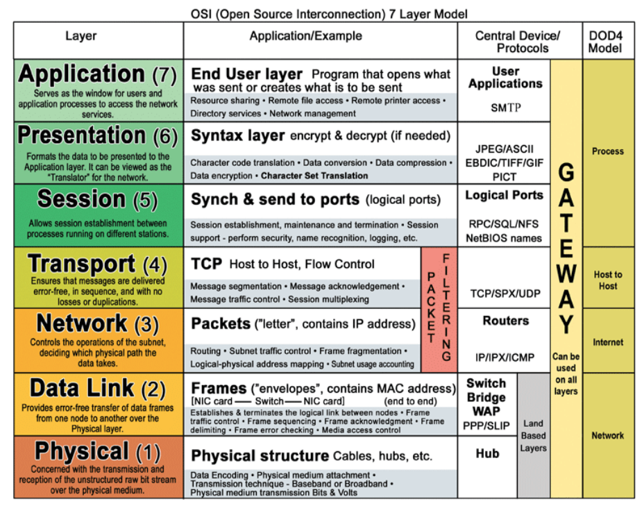
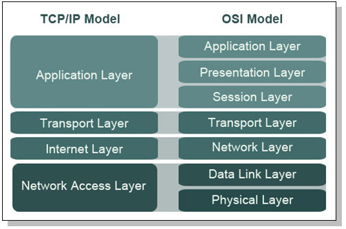
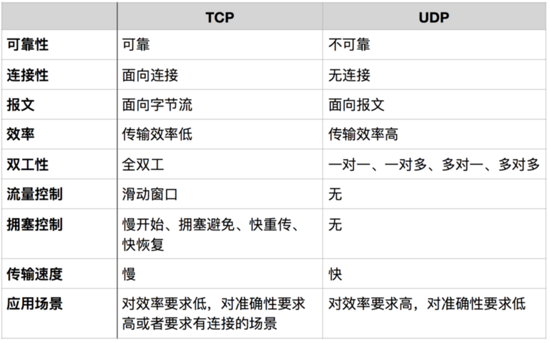
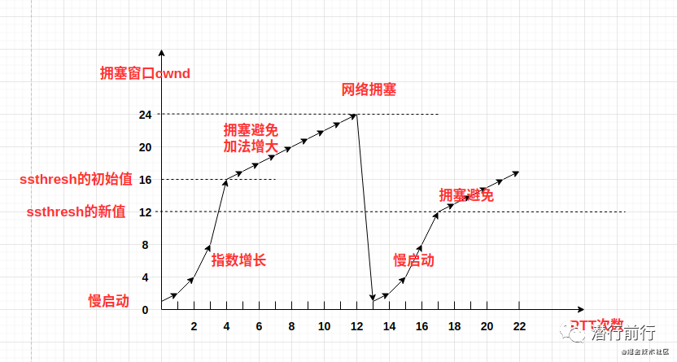
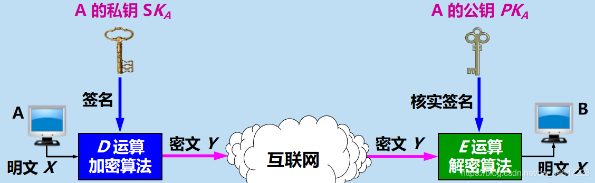

## OSI七层模型及每层简要功能描述

ARP works between Layers 2 and 3 of the Open Systems Interconnection model (OSI model).

## TCP/IP协议分层模型及每层常见协议

应用层Application Layer: HTTP, SMTP, FTP, DNS

传输层Transport Layer: TCP, UDP

网际Internet Layer: IP, ICMP, RIP, IGMP(Ping命令), 以packet为单位

网络接口层Network Access Layer: PPP, IEEE 802.2, 以帧为单位

## DNS解析过程，DNS基于哪种传输层协议

DNS解析过程: 浏览器DNS缓存=>操作系统缓存=>本地域名服务器=>迭代查询(仅给出下一个查询的IP地址)/递归查询(服务器以DNS客户端的形式继续向其他根域名服务器发送请求)

DNS基于UDP实现(减少开销)

## UDP、TCP的区别、应用场景

可靠指：无差错，不丢失，不重复，并且按序到达

面向连接：使用TCP协议之前必须先建立TCP连接

## TCP三次握手、四次挥手的详细过程

[淘宝二面，面试官居然把TCP三次握手问的这么详细-面包板社区 (eet-china.com)](https://www.eet-china.com/mp/a44399.html)

[朋友阿里面试题之 TCP/IP，回去等通知吧-阿里云开发者社区 (aliyun.com)](https://developer.aliyun.com/article/779667)

### TCP的首部包括了啥

Source port, Destination Port, Sequence Number, Acknowledgement Number, Offset(首部长度), Window(16字节，最大窗口64KB)

20字节固定首部, 后面有4n字节的变动

### TCP三次握手

- 第一次握手：客户端发送 `SYN` 报文，并进入 `SYN_SENT` 状态，等待服务器的确认；
- 第二次握手：服务器收到 `SYN` 报文，需要给客户端发送 `ACK` 确认报文，同时服务器也要向客户端发送一个 `SYN` 报文，所以也就是向客户端发送 `SYN + ACK` 报文，此时服务器进入 `SYN_RCVD` 状态；
- 第三次握手：客户端收到 `SYN + ACK` 报文，向服务器发送确认包，客户端进入 `ESTABLISHED` 状态。待服务器收到客户端发送的 `ACK` 包也会进入 `ESTABLISHED` 状态，完成三次握手。

### 为什么需要三次握手

1. 确认服务器双方的收包和发包的能力
2. 序列号可靠同步，两次连接仅仅允许一方同步ISN(Initial Sequence Number)
3. 防止已失效的连接报文突然又传送到了B，因而产生错误。假设A发出连接，但是该连接延误了很久，才到达B，B收到以后就向A发送一次新的连接请求，**假定没有三次握手，那么B的资源就被白白浪费了**。

### ISN是什么? ISN是固定不变的吗?

`ISN` 全称是 `Initial Sequence Number`，是 TCP 发送方的字节数据编号的原点，告诉对方我要开始发送数据的初始化序列号。

ISN 如果是固定的，攻击者很容易猜出后续的确认序号，为了安全起见，避免被第三方猜到从而发送伪造的 `RST` 报文，因此 ISN 是动态生成的

### 半连接队列

`SYNC_RECV`状态的连接会被放在半连接队列里

### 三次握手可以携带数据吗？

第三次可以，但前两次不行

### TCP四次挥手

- 第一次挥手。客户端发起 `FIN` 包（FIN = 1）,客户端进入 `FIN_WAIT_1` 状态。TCP 规定，即使 `FIN` 包不携带数据，也要消耗一个序号。
- 第二次挥手。服务器端收到 `FIN` 包，发出确认包 `ACK`（ack = u + 1），并带上自己的序号 seq=v，服务器端进入了 `CLOSE_WAIT` 状态。这个时候客户端已经没有数据要发送了，不过服务器端有数据发送的话，客户端依然需要接收。客户端接收到服务器端发送的 `ACK` 后，进入了 `FIN_WAIT_2` 状态。
- 第三次挥手。服务器端数据发送完毕后，向客户端发送 `FIN` 包（seq=w ack=u+1），半连接状态下服务器可能又发送了一些数据，假设发送 seq 为 w。服务器此时进入了 `LAST_ACK` 状态。
- 第四次挥手。客户端收到服务器的 `FIN` 包后，发出确认包（ACK=1，ack=w+1），此时客户端就进入了 `TIME_WAIT` 状态。注意此时 TCP 连接还没有释放，必须经过 `2*MSL`(4min) 后，才进入 `CLOSED` 状态。而服务器端收到客户端的确认包 `ACK` 后就进入了 `CLOSED` 状态，可以看出服务器端结束 TCP 连接的时间要比客户端早一些。

## 为什么建立连接握手三次，关闭连接时需要是四次呢？

其实在 TCP 握手的时候，接收端发送 `SYN+ACK` 的包是将一个 `ACK` 和一个 `SYN` 合并到一个包中，所以减少了一次包的发送，三次完成握手。

对于四次挥手，因为 TCP 是全双工通信，在主动关闭方发送 FIN 包后，接收端可能还要发送数据，不能立即关闭服务器端到客户端的数据通道，所以也就不能将服务器端的 `FIN` 包与对客户端的 `ACK` 包合并发送，只能先确认 `ACK`，然后服务器待无需发送数据时再发送 `FIN` 包，所以四次挥手时必须是四次数据包的交互。

## 为什么TIME_WAIT 状态需要经过 2MSL (Maximum Segment Lifetime，最长报文段寿命)才能返回到 CLOSE 状态？

1. 为了保证最后一个ACK报文可以到达服务器，服务器可能会超时重传FIN+ACK的报文段
2. 等待两个MSL以后，就可以确保本次连接持续时间内所产生的所有报文段都从网络中消失

## TCP keep alive

保活计时器，防止客户端出现故障时，服务器的资源被空耗。若两小时内没有收到客户的数据，服务器就发送一个探测报文段，以后每隔75秒就发送一次，若一连10次都没有得到客户的响应，服务器就认为客户端出现了故障，接着就关闭这个连接。

## TCP如何保证的可靠传输？

为了保障数据不丢失及错误（可靠性），它有报文校验、ACK应答、超时重传(发送方)、失序数据重传（接收方）、丢弃重复数据、流量控制（滑动窗口）和拥塞控制等机制.

- 滑动窗口

  TCP通过**面向字节流**的滑动窗口来实现可靠传输

  对发送方而言有**P1**(<P1的已经完成了确认), **P2**(允许发送但尚未完成确认), **P3**(>=P3的不允许发送)

  虽然发送方的发送窗口时根据接收方的接受窗口设置的，但在**同一时刻，发送方的发送窗口并不总是和接收方的接收窗口一样大**

- 确认应答

  对于不按照顺序到达的数据无明显要求

  累积确认(必须要有, 可以减小传输开销)和捎带确认(在有数据发送时把消息顺带捎带上)

- 超时重传

  当可用的发送空间被用完以后，如果还没有收到确认消息，那么发送方就会进行超时重传

## TCP流量控制机制

让发送方的发送速率不要太快，要让接收方来得及接收

rwnd(receiver window)通过窗口字段进行控制

零窗口探测报文段

## TCP拥塞控制机制

### 慢开始和拥塞避免

发送方维持一个叫做拥塞窗口cwnd(congestion window)的状态变量, **发送方让自己的发送窗口等于拥塞窗口**

1. 慢开始: 拥塞窗口初始为1个报文段，每经过一次RTT或传输轮次(强调把cwnd所有数据都发送了出去并收到回复)，窗口大小翻倍(指数增长，只是前期慢)
2. 拥塞避免: 让拥塞窗口缓慢增大，发送方的cwnd达到阈值ssthresh之后，每经过一个往返时间RTT就把发送方的拥塞窗口cwnd+1，遇到拥塞以后，重新进入慢开始状态, ssthresh=1/2ssthresh

### 快重传和快恢复

1. 快重传: 尽早让发送方知道发生了个别报文段的丢失，快重传是接收方收到了一个失序的报文，则立马报告给发送方，赶紧重传。收到失序报文段也要立即发送对已收到的报文段的重复确认。发送方只要一连3次收到3个重复确认，就知道接收方确实没有收到消息，因而立即进行重传(即"快重传")
2. 快恢复: 当发送方连续收到三个重复确认，ssthresh减半；由于发送方可能认为网络现在没有拥塞，因此与慢启动不同，把cwnd值设置为ssthresh减半之后的值，然后执行拥塞避免算法，cwnd线性增大

## 流量控制与拥塞控制的区别

流量控制: 接收方控制发送方，防止发送方发送的太快，本质上是一个端到端

拥塞控制: 发送方控制网络，防止过多数据注入网络，这样可以使网络中的路由器或链路不致于过载

## HTTP是一个面向文本的协议

## HTTP有哪些方法，GET和POST的区别

OPTION(请求一些选项信息), **GET**(读取由URL标识的信息), HEAD(读取由URL标识的信息的首部), **POST**(给服务器添加信息), **PUT**(在指明的URL下存储一个文档), **DELETE**(删除指明的URL所标志的资源), TRACE(用于环回测试的请求报文), CONNECT(用于代理服务器)

- GET在浏览器**回退**时是无害的，而POST会再次提交请求。
- GET产生的URL地址可以被**Bookmark**，而POST不可以。
- GET请求会被浏览器**主动cache**，而POST不会，除非手动设置。
- GET请求参数会被完整保留在**浏览器历史记录**里，而POST中的参数不会被保留。
- GET请求只能进行**url编码**，而POST支持**多种编码方式**。
- GET请求在**URL中传送的参数是有长度限制**的，而POST没有。
- 对参数的数据类型，GET只接受**ASCII字符**，而POST没有限制。
- GET比POST**更不安全**，因为参数直接暴露在URL上，所以不能用来传递敏感信息。
- GET参数通过**URL传递**，POST放在**Request body**中

虽然说`POST`会发两个tcp包，但实际的测试里看很多已经没有这个区别了，取决于具体的客户端实现。

## HTTPS连接过程

### 两种加密体系

- 对称加密: D_key(E_key(x)) = x，加密密钥与解密密钥是使用相同的密码体制
- 非对称加密: D_seck(E_pubk(x)) = x, E_pubk(D_seck(x))，公钥可以用于加密，但不可以用于解密，从pubk到seck是"计算上不可能的"

### 数字签名

