## 用户态和内核态的区别，用户态如何切换到内核态

https://stackoverflow.com/a/48829759/7624082

https://blog.codinghorror.com/understanding-user-and-kernel-mode/

**Why Linux does not use ring 1 and ring 2?**

### 二者的大致区别

可以从cpu rings的角度来解释

大概应该是包括了硬件，内存地址，ISA这三方面的区别

- kernel mode: accesses **any memory addresses**; **crashes** in kernel mode catastrophic, they will halt the entire PC

- user mode: no ability to directly access hardware or reference memory, must delegate to system APIs to access hardware or memory

**they're enforced by the CPU hardware, if violated will throw a trappable exception** 一个程序挂了，整个机器无需重启，比如说windows98

### 如何确定current ring

GDT Table和segment register

### 如何切换

syscall和int 0x80

其实CALL指令和JMP指令也可以切换

系统调用，中断，异常

### What is asmlinkage?

The asmlinkage tag is one other thing that we should observe about this simple function. This is a #define for some gcc magic **that tells the compiler that the function should not expect to find any of its arguments in registers** (a common optimization), but only on the CPU's stack. Recall our earlier assertion that system_call consumes its first argument, the system call number, and allows up to four more arguments that are passed along to the real system call. system_call achieves this feat simply by leaving its other arguments (which were passed to it in registers) on the stack. All system calls are marked with the asmlinkage tag, so they all look to the stack for arguments. Of course, in sys_ni_syscall's case, this doesn't make any difference, because sys_ni_syscall doesn't take any arguments, but it's an issue for most other system calls. And, because you'll be seeing asmlinkage in front of many other functions, I thought you should know what it was about.

It is also used to allow calling a function from assembly files.

### protection rings

only rings 0(kernel) and 3(user) are typically used


### 内核态如何访问用户态内存

`copy_from_user`, `copy_to_user`，处理访问的range是否合法以及非法的内存访问。

### 内核空间和用户空间

内核空间为上面1G，用户空间为下面3G

## 进程和线程的区别和联系

进程是资源分配的最小单位，线程是CPU调度的最小单位

为了解决进程间数据不易共享，通信开销高等问题，操作系统在内部又引入了更轻量级的执行单元，也就是线程

每个线程会共享instruction, global, and heap regions，但是会有自己的registers和stack，**thread的通信几乎不需要syscall**.

## 进程的状态、线程的状态

参考陈海波的书，建议画

新生(还未完成初始化), 预备(还没被调度), 阻塞(等待外部事件), 运行(运行中断了就回到预备), 终止

## 用户态线程和内核态线程

由内核创建的线程和由用户创建的线程

没有用户空间称为内核态线程，共享用户空间称为用户态线程

##  **Linux中如何创建进程以及创建进程后如何区分子进程？**

使用fork()调用创建子进程，fork()调用返回两个值，大于0的表示父进程，等于0的表示子进程。

## 一个进程可以分配多少个线程

1. 32位系统，用户态的虚拟空间只有3G，如果创建线程时分配的栈空间是10M，那么一个进程最多只能创建300个左右的进程
2. 64位系统，用户态的虚拟空间最大有128T，理论上不会受到虚拟内存大小的限制，但实际上会受到系统参数(threads-max, pid_max, max_map_count)和物理性能的限制

## 一个进程的虚拟内存空间包括哪些部分?BSS和data的区别

内存虚拟空间

栈，共享库文件，堆，bss，data，text

**BSS refers to uninitialized global and static objects and Data refers to initialized global and static objects**. 

## fork, vfork, clone, posix_spawn

vfork不拷贝地址空间，子进程与父进程共享同一地址空间

rfork/clone可以自定义父进程和子进程共享的内容，支持细粒度的资源共享

posix_spawn是fork+exec，但是不够灵活

## fork系统调用，父进程和子进程具体有哪些一样，哪些不同

[fork(2) - Linux manual page (man7.org)](https://man7.org/linux/man-pages/man2/fork.2.html)

```
so the only penalty that it incurs is the time and memory required to duplicate the parent's page tables, and to create a unique task structure for the child.
```

- memory(code, globals, heap and stack), registers, and open files. entire virtual address space

- process ID, parent process ID, memory locks, process resource utilizations, pending signals(initially empty), semaphore adjustments, process-associated record locks(On the other hand, it does inherit fcntl(2) open file description locks and flock(2) locks from its parent.), timers, AIO operations, AIO contexts.  madvise(2)

## 多线程调用fork

A process shall be created with a single thread. If a multi-threaded process calls *fork*(), the new process shall contain a replica of the calling thread and its entire address space, possibly including the states of mutexes and other resources. Consequently, to avoid errors, the child process may only execute async-signal-safe operations until such time as one of the *[exec](https://pubs.opengroup.org/onlinepubs/000095399/functions/exec.html)* functions is called. [[THR](javascript:open_code('THR'))] ![[Option Start]](../images/os/opt-start.gif) Fork handlers may be established by means of the [*pthread_atfork*()](https://pubs.opengroup.org/onlinepubs/000095399/functions/pthread_atfork.html) function in order to maintain application invariants across *fork*() calls. ![[Option End]](../images/os/opt-end.gif)

## fork和exec的区别

exec的步骤:

1. 根据pathname的路径，将可执行文件的数据段和代码段载入到当前进程的地址空间中
2. 重新初始化堆和栈
3. 将PC寄存器设置到可执行文件代码段定义的入口点

- fork的地址空间仍然是一样的，但是process ID不同了
- exec的地址空间变了，但是process ID依然是同一个

## 守护进程、僵尸进程和孤儿进程是什么

1. 一个父进程退出，而它的一个或多个子进程还在运行，那么那些子进程将成为孤儿进程。孤儿进程将被init进程(进程号为1)所收养，并由init进程对它们完成状态收集工作。\s
2. 一个进程使用fork创建子进程，如果子进程退出，而父进程并没有调用wait或waitpid获取子进程的**状态信息**，那么子进程的进程描述符仍然保存在系统中。这种进程称之为僵死进程。**这时用ps命令就能看到子进程的状态是“Z”**
3. Linux Daemon（守护进程）是运行在后台的一种特殊进程。它独立于控制终端并且周期性地执行某种任务或等待处理某些发生的事件。它不需要用户输入就能运行而且提供某种服务，不是对整个系统就是对某个用户程序提供服务。Linux系统的大多数服务器就是通过守护进程实现的。常见的守护进程包括系统日志进程syslogd、 web服务器httpd、邮件服务器sendmail和数据库服务器mysqld等。

## 进程上下文切换包括了哪些内容

用户级上下文：指令，数据，共享[内存](https://so.csdn.net/so/search?q=内存&spm=1001.2101.3001.7020)、用户栈
寄存器上下文：[程序计数器](https://so.csdn.net/so/search?q=程序计数器&spm=1001.2101.3001.7020)，通用寄存器，控制寄存器，状态字寄存器，栈指针（用来指向用户栈或者内存栈）
系统级上下文：pcb，主存管理信息（页表&段表）、核心栈

## 中断上下文切换包括哪些内容

EFLAGS, CS, EIP，可能包括三个堆栈寄存器

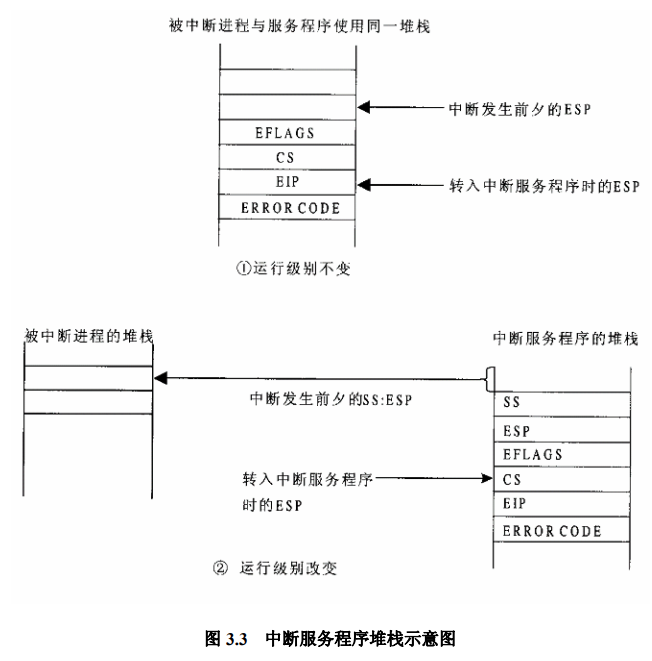

## 为什么说进程上下文的代价比线程大

实际上就是registers，会保存在进程控制块(Process Control Block, PCB)具体对应到代码就是linux里的task_struct，

主要是进程需要**切换virtual memory space**，如TLB这样的就失去了作用

For example, x86 has to flush the TLB and some ARM processors have to flush the entirety of the L1 cache!

进程的上下文切换不会切换内核空间，只会切换用户空间

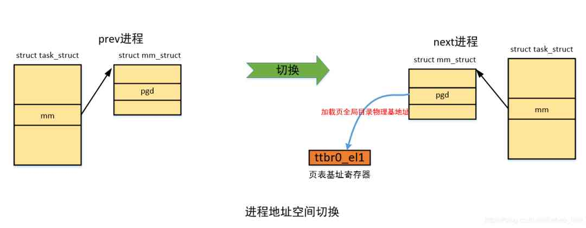

fp, sp等指针会从next进程的cpu context里获取

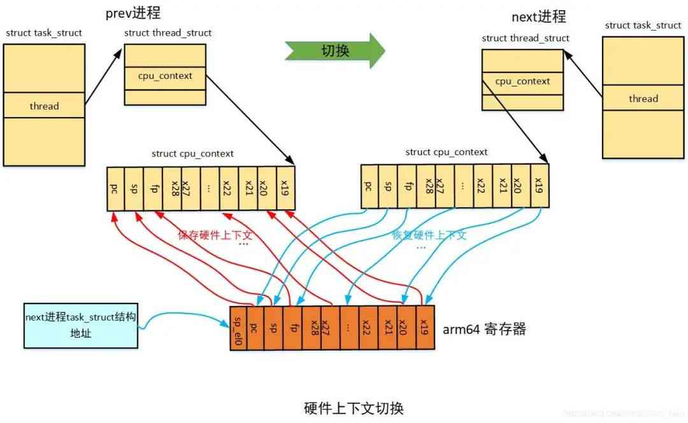

## kill -9或ctrl+c到底发生了什么

SIGKILL, SIGINT，ctrl+c多了一个硬件中断

- 执行kill程序需要一个pid，根据这个pid找到这个进程的task_struct（这个是Linux下表示进程/线程的结构），然后在这个结构体的特定的成员变量里记下这个信号。这时候信号产生了但还没有被特定的进程处理，叫做Pending signal。 等到下一次CPU调度到这个进程的时候，内核会保证先执行`do_signal`这个函数看看有没有需要被处理的信号，若有，则处理；若没有，那么就直接继续执行该进程。

- 用户按下Ctrl-C，这个键盘输入产生一个硬件中断。如果CPU当前正在执行这个进程的代码，则该进程的用户空间代码暂停执行，CPU从用户态切换到内核态处理硬件中断。终端驱动程序将Ctrl-C解释成一个SIGINT信号，记在该进程的PCB中（也可以说发送了一个SIGINT信号给该进程）。当某个时刻要从内核返回到该进程的用户空间代码继续执行之前，首先处理PCB中记录的信号，发现有一个SIGINT信号待处理，而这个信号的默认处理动作是终止进程，所以直接终止进程而不再返回它的用户空间代码执行。

## CPU中断

[中断及中断处理过程_bleauchat的博客-CSDN博客_中断处理过程](https://blog.csdn.net/bleauchat/article/details/97171391)

### 中断, 陷阱, 异常

中断有两种，一种是由CPU外部产生的，另一种是由CPU本身在执行程序的过程中产生的。

> 中断：外部中断通常就是所讲的中断"interrupt"，**异步**
>
> 陷阱：软件所产生的中断则不同，它是由专设的指令，如X86中的"INT n"在程序中有意为之的，syscall就是一种trap，**同步**
>
> 异常：多半由于不小心产生，如除法的时候除以0，**一般也是异步**

### 中断（异常）处理过程

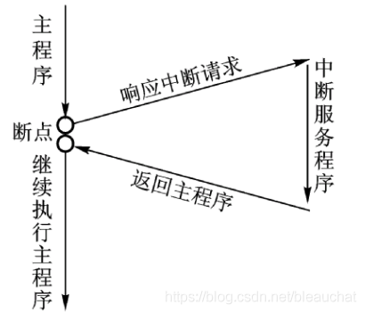

在执行完当前指令以后，或在执行当前指令的中途，就根据中断源所提供的“中断向量”，在内存中找到相应的服务程序入口并调用该服务程序。

1. 首先根据中断源头的中断向量(INT提供的参数或者硬件中断)，在IDT表里找到一扇门(descriptor，其中保存着中断服务程序的段选择符)，确认CPL(Current Priviledge Level)<=DPL(Descriptor Priviledge Level)。

2. 保护现场：将EFLAGS寄存器的内容以及返回地址压入堆栈，返回地址是由段寄存器CS和取指令指针EIP的内容共同组成的。如果中断由异常引起，则还需要将异常原因的出错代码也压入堆栈。如果DPL和CPL不同，那么还需要额外压入堆栈的指针。
3. 根据中断门的位移和当前的GDT/LDT找到对应的中断服务程序入口，执行中断服务程序
4. 返回，并恢复现场

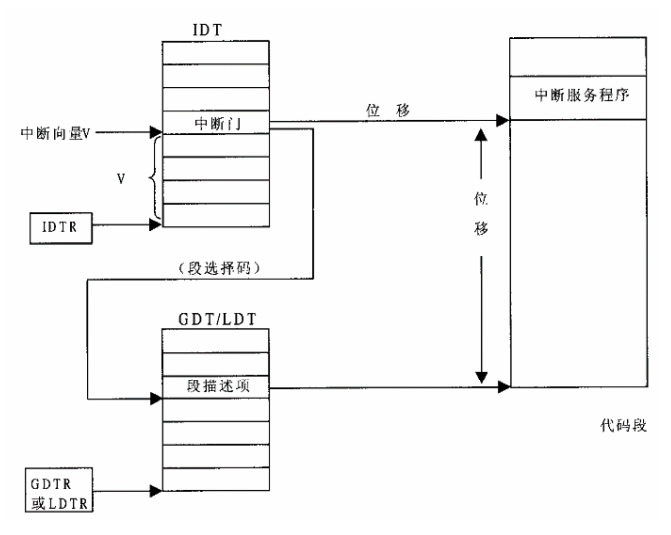

### 中断门与陷阱门的区别

唯一区别在于中断门在进入中断服务程序时，CPU会自动关闭中断

### syscall的过程

INT 0x80，压入eax作为跳转表index，然后是其他参数，syscall的参数不超过5个

## BIO, NIO, AIO之间的区别

BIO是同步阻塞，NIO是同步非阻塞(Selector, Channel, Buffer)，AIO是异步非阻塞(Windows下IOCP，Linux下boost aio)

> 阻塞I/O等待的是「内核数据准备好」和「数据从内核态拷贝到用户态」这两个过程，非阻塞I/O则仅仅会等待「数据从内核态拷贝到用户态」
>
> 异步的I/O则两个都不会等待
>
> 同步与异步关注的是函数调用者是否需要等待调用函数执行完毕再返回，callback

## Linux I/O协议栈

1. normal

   applications => VFS => device on top of "normal block devices" => Block Layer(I/O scheduler, blkmq) => request based drivers => physical device

2. mmap

   applications => Page Cache => BIO Based drivers

3. network

   applications => Network VFS => network

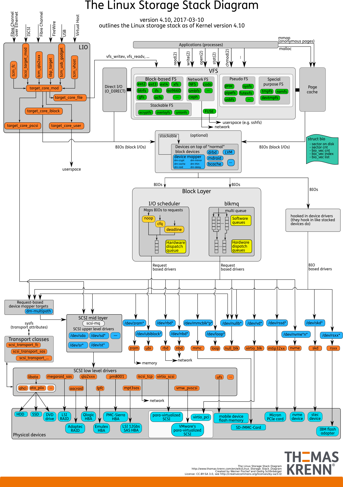

## 5种IO模型

[100%弄明白5种IO模型 - 知乎 (zhihu.com)](https://zhuanlan.zhihu.com/p/115912936)

## Proactor和Reactor

**Reactor 是非阻塞同步网络模式，感知的是就绪可读写事件**。在每次感知到有事件发生（比如可读就绪事件）后，就需要应用进程主动调用 read 方法来完成数据的读取，也就是要应用进程主动将 socket 接收缓存中的数据读到应用进程内存中，这个过程是同步的，读取完数据后应用进程才能处理数据。

**Proactor 是异步网络模式， 感知的是已完成的读写事件**。在发起异步读写请求时，需要传入[数据缓冲区](https://www.zhihu.com/search?q=数据缓冲区&search_source=Entity&hybrid_search_source=Entity&hybrid_search_extra={"sourceType"%3A"answer"%2C"sourceId"%3A1856426252})的地址（用来存放结果数据）等信息，这样系统内核才可以自动帮我们把数据的读写工作完成，这里的读写工作全程由操作系统来做，并不需要像 Reactor 那样还需要应用进程主动发起 [read/write](https://www.zhihu.com/search?q=read%2Fwrite&search_source=Entity&hybrid_search_source=Entity&hybrid_search_extra={"sourceType"%3A"answer"%2C"sourceId"%3A1856426252}) 来读写数据，操作系统完成读写工作后，就会通知应用进程直接处理数据。

## 进程间通信方式

参考APUE

### pipe

1. Historically, they have been half duplex
2. Pipes can be used only between processes that have a common ancestor.

可以有多个写的进程，单个原子写的大小为`PIPE_BUF`，但一般都只有一个写入的进程

### FIFO

也被称为named pipes，有名管道. FIFO is a type of file.

一般先通过`mkfifo`或者`mkfifoat`来创建一个FIFO，然后再通过`open`来打开

FIFO的`O_NONBLOCK`，需要w和r端都打开文件

FIFO一般会有多个写入端

1. used by shell commands to pass data from one shell pipeline to another without creating intermediate temporary files
2. FIFOs are used as rendezvous points in client-server applications to pass data between the clients and the servers.

### pipe和FIFO的区别

pipe和FIFO都只能支持一个reader，pipe一般只有一个writer，而FIFO一般会有多个writer。pipe的进程之间必须要有联系，FIFO的进程之间不需要有联系(因为FIFO本质上是一个文件)。FIFO还需要打开文件。

在Linux VFS里pipe和FIFO都被实现为pipefs的"file", FIFO仅仅是pipe的一个thin wrapper

### message queues

是一种XSI IPC

a **linked list of messages** stored withn the kernel and is identified by a message queue identifier.

message queue identifier是一个整数, `IPC_PRIVATEˈ`

消息的格式: a positive long integer **type field**, a non-negative length and the actual data bytes.
type field的作用是作为priority或者标记client

发送消息时需要从用户态的`msg_buf`发送到内核态的`msg_msg`

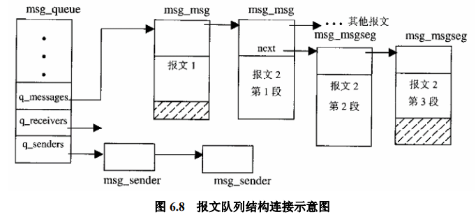

### 管道、消息队列本质是什么

管道的本质是一个伪文件(一个在内存里的inode，内部有一个循环缓冲区)，读写的位置和锁都会被保存在数据结构里，会有reference counting。

消息队列的本质则是一个a linked list of messages数据结构，没有reference counting，只有一个全局的`ipc_ids`来对所有message queue进行管理

### 消息队列和管道的区别是什么

1. 管道的信息是无格式的字节流，消息队列是有格式的字节流
2. 缺少优先级别这样的控制手段
3. 管道的缓冲区大小是有限的，静态的。当发送者写满了缓冲区而接收者没有来得及从缓冲区读走，发送者就只好停下来睡眠，这就强化了管道机制的同步性要求。固然可以使用`O_NONBLOCK`，但是这样会增加应用程序的复杂性，还会进一步降低效率。再者，管道机制也无法让发送者预先知道缓冲区中的可用空间
4. 开销，现在已经差别不大
5. 每个管道都要占用一个文件号

### semaphore(用户态信号量)

在msg_ids里就使用了semophore来进行保护

共享内存不具有同步的功能，因而还需要其他机制的配合，比如信息量

`semop`的操作是**原子操作**也是对**信号量集合**的操作(解决**哲学家与刀叉**问题), 定义了一个array的操作，这一个array里的操作应该都是atomic的

### 最快的通信方式是什么，为什么共享内存最快，与mmap的区别

共享内存，因为共享内存无需在client和server之间copy数据。但需要semaphore, record locking, or mutexes。无需在用户态和内核态之间进行切换。

mmap需要有一个file作为backend, (可以用/dev/zero或者anonymouse memory mapping绕过这个限制，但是必须是关联的进程)

### ptrace(TODO)

syscall时会检查task_struct里的标志位`PT_TRACESYS`

## 同步原语

### 皮特森算法

如果没有turn的话，会死锁，需要turn来定序

```c++
/* process 0 */
while (true)
{
    FLAGS[0] = true;
    turn = 1;
    while (FLAGS[1] && turn == 1);
    /* critical section */
    FLAGS[0] = false;
}

/* process 1 */
while (true)
{
    FLAGS[1] = true;
    turn = 0;
    while (FLAGS[0] && turn == 0);
    /* critical section */
    FLAGS[1] = false;
}
```

### CAS

检测如果是旧值就尝试更新并返回旧值，如果不是的话，另一个值 

#### intel

```c++
int atomic_CAS(int *addr, int expected, int new_value)
{
    asm volatile("lock cmpxchg %[new], %[ptr]")
        :"+a" (expected), [ptr] "+m" (*addr)
        :[new] "r" (new_value)
        :"memory")
    return expected;
}
```

#### ARM AArch64

Load/Link(`ldxr`)和Store-Conditional(`stxr`)

```c++
int atomic_CAS(int *addr, int expected, int new_value)
{
    int oldval, ret;
    asm volatile(
        "1: ldxr	%w0, %2\n"
        "	cmp		%w0, %w3\n"
        "	b.ne	2f\n"
        "	stxr	%w1, %w4, %2\n"
        "	cbnz	%w1, lb\n"
        "2: "
        : "=&r" (oldval), "=&r" (ret), "+Q" (*addr)
        : "r" (expected), "r" (new_value)
        : "memory");
	return oldval;
}
```

### 互斥锁

自旋锁, ticket lock

### 条件变量

避免忙等

### 互斥锁与条件变量

互斥锁用于解决临界区问题，保证互斥访问共享资源。而条件变量通过提供挂起/唤醒机制来避免循环等，节省CPU资源。条件变量需要和互斥锁搭配使用。

### 信号量

P是检验，V是自增。一般用wait和signal来表示

### 互斥锁与信号量

信号量的wait和signal操作分别与互斥锁的lock与unlock操作类似。我们称这种信号量为二元信号量。

区别在于：互斥锁有**拥有者**这个概念，而二元信号量没有。互斥锁往往由同一个线程加锁和放锁，而信号量允许不同线程执行wait与signal操作。

### record locking

Locks are associated with **a process and a file**.

Locks are never inherited by the child across a fork.

Locks are inheried by a new program across an exec.

Locks at End of File (offset=-1)

### 读写锁

```c++
// 偏向读者的读写锁，需要注意的是读写锁的核心不在于简化读者加锁放锁的流程，而在于增加读者的并行度
struct rwlock {
    int reader_cnt;
    lock read_lock;
    lock write_lock;
	void lock_reader();
    void unlock_reader();
    void lock_writer();
    void unlock_writer();
}

void rwlock::lock_read() {
    read_lock.lock();
    reader_cnt++;
    if (reader_cnt == 1) {
        write_lock.lock();
    }
    read_lock.unlock();
}

void rwlock::unlock_read() {
    read_lock.lock();
    reader_cnt--;
    if (reader_cnt == 0) {
        write_lock.unlock();
    }
    read_lock.unlock();
}

void rwlock::lock_write() {
    write_lock.lock();
}

void rwlock::unlock_write() {
    write_lock.unlock();
}

// 偏向写者的读写锁
struct rwlock {
    int reader_cnt;
	bool has_writer;
    condition_variable write_cond;
    condition_variable read_cond;
    lock lock;
	void lock_reader();
    void unlock_reader();
    void lock_writer();
    void unlock_writer();
}

void rwlock::lock_read() {
    lock.lock();
    while (has_writer) {
        wait(&write_cond, &lock);
    }
    reader_cnt++;
    lock.unlock();
}

void rwlock::unlock_read() {
    lock.lock();
    reader_cnt--;
    if (reader_cnt == 0) {
        signal(&read_cond);
    }
    lock.unlock();
}

void rwlock::lock_write() {
    lock.lock();
    while (has_writer) { // 先修改has_writer
        wait(&write_cond, &lock);
    }
    has_writer = true;
    while (reader_cnt > 0) { // 使用while是为了防止signal多个线程
        wait(&read_cond, &lock);
    }
    lock.unlock();
}

void rwlock::unlock_write() {
    lock.lock();
    has_writer = false;
	signal(&write_cond);
    lock.unlock();
}
```

### RCU

RCU是一个链表，通过原子操作来实现读写之间的不阻塞，类似MVCC。

grace period指在删除操作以后，过多久才可以回收内存

### futex

`void futex_wait(int *uaddr, int val)`和`void futex_wake(int *uaddr)`

使用futex实现互斥锁

```c++
struct lock {
	int lock_val;
    int waiters;
};

void lock(struct lock *lock)
{
    while (atomic_CAS(&lock->lock_val, 0, 1) != 0) {
		atomic_FAA(&lock->waiters, 1);
        futex_wait(&lock->lock_val, 1); // only wait if lock_val == 1, else just return
        atomic_FAA(&lock->waiters, -1);
    }
}

void unlock(struct lock *lock)
{
    lock->lock_val = 0;
    if (lock->waiters != 0)
        futex_wake(&lock->lock_val);
}
```


## 产生死锁的四个必要条件：

（1） 互斥条件：一个资源每次只能被一个进程使用。

（2） 持有并等待：一个进程因请求资源而阻塞时，对已获得的资源保持不放。

（3） 资源非抢占：进程已获得的资源，在末使用完之前，不能强行剥夺。

（4） 循环等待：若干进程之间形成一种头尾相接的循环等待资源关系。

## 分页与分段的区别

- 页是信息的物理单位，分页是为实现离散分配方式，以消减内存的外部碎片，提高内存的利用率。页的大小固定且由系统决定

- 段则是信息的逻辑单位，它含有一组其意义相对完整的信息。分段的目的是为了能更好地满足用户的需要，尽管可以实现离散分配，但也容易造成外部碎片。

| 分页                                   | 分段             |
| -------------------------------------- | ---------------- |
| 固定页面大小                           | 段的大小不固定   |
| 程序员看不见                           | 对程序员可见     |
| 一个线性地址空间                       | 多个线性地址空间 |
| 不允许对应用程序组件进行逻辑分区和保护 | 允许             |

## 物理地址、虚拟地址、分页、页表、MMU、缺页中断、页面置换[算法](http://jump/super-jump/word?word=算法)这一整套东西

### 虚拟地址，逻辑地址，线性地址，物理地址

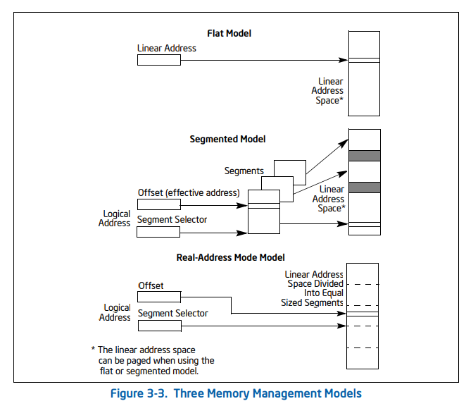

- A logical address consists of a segment  selector and an offset.
- 虚拟地址: 指开启paging以后经由逻辑地址翻译来的地址
- linear address: physical address or virtual address
- physical address: 物理地址

### 缺页中断

[内核缺页原理简介 · 语雀 (yuque.com)](https://www.yuque.com/books/share/ef40e95e-e3bc-4ebd-9534-106920227368/eiyund)

当访问应用程序已经分配但未映射至物理内存的虚拟页时，就会触发缺页异常，然后会允许操作系统预先设置的page fault handler

swap in && swap out

在x86-64架构下，缺页异常会触发13号异常

1. 可以把物理内存放不下的数据临时存放到磁盘上，等到需要的时候再放回到物理内存中
2. 按需页分配，节约物理内存，提升资源利用效率

虚拟内存区域(Virtual Memory Area, VMA)用于区分是未分配，还是已分配但是还未映射至物理内存的状态

缺页由缺页中断进行处理，当进程操作异常的虚拟地址时，触发缺页中断，开始处理这次缺页，CPU将引起缺页的`虚拟地址存入寄存器cr2`，然后保存上下文并调用`do_page_fault()进行C代码级别缺页处理流程`。

可以分为**软性**(已经加载但是还没有注册到MMU), **硬性**(还未被加载到内存), **无效**(访问的地址不存在)

1. 匿名映射缺页异常：由于匿名的mmap的初始值为0, 所以对这个的读取操作一开始是map到zero page，写操作则会申请内存。先读后写则引发COW写时复制缺页。
2. 文件映射缺页
3. 写时缺页：匿名缺页里使用的，分配一个新的页，然后填满0，返回
3. COW写时复制缺页异常：fork引发的异常
   1. 一旦某一方率先进行写操作，就触发写异常缺页，发现有他人引用页，`则进行写时复制，分配新页，拷贝一份原页的内容的到新页中`，然后设置页表为可写，递减引用计数和映射计数或者递减交换计数。
   2. `另一方面，后来的进程对其写时，也发生写异常缺页，但发现没有他人引用页，则进行修改页表项为可写`。
4. 交换缺页：当内核在物理内存紧张的时候，内核内存回收机制将用户进程的特定的部分物理页通过。交换分区写入磁盘或文件（比如在alloc_pages()时触发交换机制），然后将`该页在交换分区的标记写入原页表`项代替页号，并将页表项的驻留内存属性清零。所有在交换分区之上构建了交换页高速缓存，在交换的换入换出中都先操作缓存，然后再周期的将没有被任何人引用的页写入磁盘
4. 内核非连续内存映射缺页, vmalloc是把这块内存映射到了内核的虚拟地址空间(init_mm),并没有映射到当前进程的内核态页表
7. 指令预提取缺页

### MMU

虚拟地址到物理地址，同时会产生page fault

内存管理单元MMU。他由一个或一组芯片组成，一般存在与协处理器中，其功能是把虚拟地址映射为物理地址

与CPU之间靠地址总线相连

### 页面置换算法

MIN/OPT策略，FIFO策略，Second Chance策略，LRU策略，MRU策略，时钟算法(类似Second Chance，但更加高效)

## cache和buffer的区别

Cached is the size of the page cache. Buffers is the size of in-memory block I/O buffers. 

Cached matters; Buffers is largely irrelevant.

## 进程内存空间

[Linux的进程地址空间-知乎](https://zhuanlan.zhihu.com/p/66794639)

[Linux虚拟地址空间布局 - 知乎 (zhihu.com)](https://zhuanlan.zhihu.com/p/378943558)

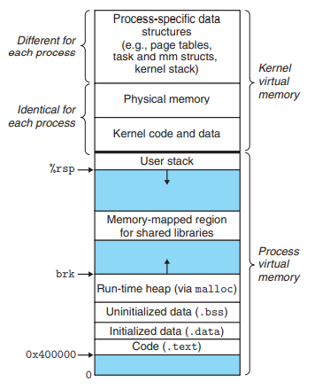

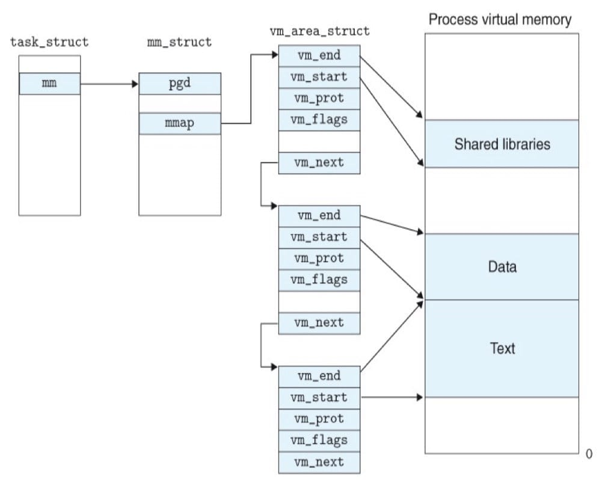

内核空间

- 所有进程共享的内核区域: 如内核的代码和全局数据结构
- 进程独有的内核区域: 页表, 内核在进程的上下文中执行代码时使用的栈

用户空间

- user stack: 局部变量，函数参数，返回地址等

- mmap region for shared library: 用于映射shared library
- heap: 存放程序进行时动态分配的内存段, `brk`, `sbrk`
- bss段: 未初始化的数据段
- data段: 初始化后的数据段
- text段: 代码段

**pgd**: page global directory

mm_struct: 当前虚拟内存的状态

## buddy系统和slab分配

- buddy系统: 将物理内存划分为连续的块，以块为单位进行分配。**不同块的大小可以不同，但每个块都由一个或多个连续的物理页组成**。主要思想以2的幂次为单位分配内存和合并空闲内存。

  `/proc/buddyinfo`

- slab系统:

  `/proc/slabinfo`

  [The Slab Allocator in the Linux kernel (hammertux.github.io)](https://hammertux.github.io/slab-allocator)

  [Slab Allocator (kernel.org)](https://www.kernel.org/doc/gorman/html/understand/understand011.html#Sec: Per-CPU Object Cache)

  [Linux 内核 | 内存管理——slab 分配器 - 知乎 (zhihu.com)](https://zhuanlan.zhihu.com/p/358891862) 

  

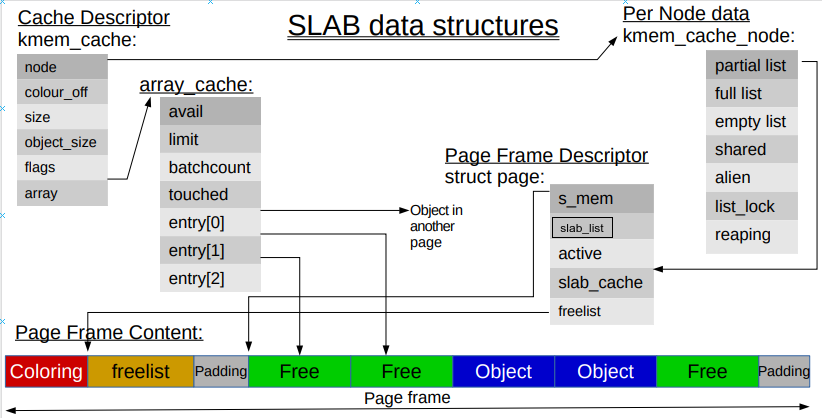

1. 主要的设计目的是为了缓解buddy系统的内部碎片
2. maintain cache of commonly used objects. When a new slab is created, a number of objects are packed into it and initialised using a constructor if available. When an object is freed, it is left in its initialised state so that object allocation will be quick.
3. hardware cache utilization. **color** the slab. **By placing objects at a different starting offset within the slab**, it is likely that objects will use different lines in the CPU cache helping ensure that objects from the same slab cache will be unlikely to flush each other.

pages为一个或多个连续的页

sizes cache: 有特殊大小的slab cache

per-cpu cache: 为每个cpu准备的slab cache，`kmem_cache`有一个`struct array_cache __percpu *cpu_cache`的属性就是为了保存每个CPU较热的数据, Has **LIFO ordering** to take advantage of cache hotness and aims to hand out “cache warm” objects. 

## vmalloc和kmalloc和malloc

malloc is used for **user space memory allocation.**

kmalloc用于slab分配, physically contiguous

Vmalloc() is used to allocate memory from the kernel.The memory allocated is virtually contiguous but not physically contiguous.和malloc差不多

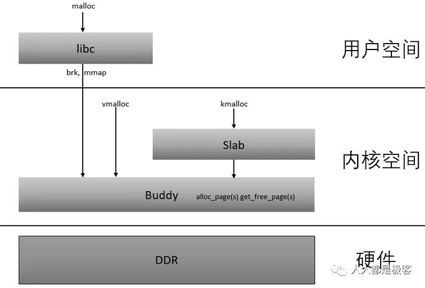

## ptmalloc, tcmalloc, jemalloc的区别(TODO)


## 零拷贝是什么

是一种 I/O 操作优化技术，可以快速高效地将数据从文件系统移动到网络接口，而不需要将其从内核空间复制到用户空间

[原来 8 张图，就可以搞懂「零拷贝」了 - 小林coding - 博客园 (cnblogs.com)](https://www.cnblogs.com/xiaolincoding/p/13719610.html)

- 普通的发送文件流程

  ```c++
  read(file, tmp_buf, len);
  write(socket, tmp_buf, len);
  ```

  read => 内核态 => DMA从磁盘读取到Page Cache => 从Page Cache拷贝到用户态 => 用户态

  write => 用户态 => 从用户态拷贝到socket缓冲区 => DMA从socket到网卡 => 用户态

- mmap + write

  减少了拷贝到用户态的操作

  ```c++
  buf = mmap(file, len);
  write(sockfd, buf, len);
  ```

  write => 内核态 =>  DMA拷贝到Page Cache => CPU拷贝 => socket缓冲区 => DMA拷贝到网卡

- sendfile

  ```c++
  ssize_t sendfile(int out_fd, int in_fd, off_t *offset, size_t count);
  ```

  只有一次系统调用，但是依然会拷贝到socket缓冲区

- 支持SG-DMA的sendfile

  socket缓冲区也不会拷贝

  sendfile => 内核态 => DMA拷贝到Page Cache =>  DMA拷贝到网卡

- 大文件的传输

  异步IO + 直接IO，避免污染Page Cache

  

大文件用异步IO+直接IO，小文件用零拷贝

## select/poll/epoll的区别 五种IO模型 io_uring

### select/poll/epoll的区别和5种IO模型

[Linux select源码分析 - 简书 (jianshu.com)](https://www.jianshu.com/p/95b50b026895)

简单的non-blocking I/O: try了以后等待一段时间再去poll数据，

async I/O: 通过信号来进行I/O，存在两个问题

1. 标准不统一
2. 仅能通过单个进程进行

I/O多路复用: build a list of the descriptors that we are interested in and call a function that doesn't return until one of the descriptors is ready for I/O.(select, poll, epoll仅仅支持网络I/O)

```c++
// select的主要逻辑
asmlinkage long sys_poll(struct pollfd * ufds, unsigned int nfds, long timeout)
{
	/* 
	 * 注册回调函数__pollwait，不同类型的fd会有不同的__pollwait，如tcp_poll, udp_poll 
	 * 等__pollwait就是把current（当前进程）挂到设备的等待队列，不同设备有不同等待队列，如
	 * tcp_poll的等待队列是sk->sk_sleep（把进程挂到等待队列中并不代表进程已睡眠）
	 */
	poll_initwait(&table);
    wait = &table;
	if (!timeout)  /* 如果timeout为0，那么就无需注册wait */
		wait = NULL;

    /* 从用户态内存拷贝fds到内核态 */
    for (i=0; i < nchunks; i++)
		if (copy_from_user(fds[i], ufds + i*POLLFD_PER_PAGE, PAGE_SIZE))
			goto out_fds1;  /* error handling */

    /* 进行一次poll, 遍历所有的nfds, 如果有timeout，那么就将回调函数加入到设备的队列中 */
	fdcount = do_poll(nfds, nchunks, nleft, fds, wait, timeout);

	/* 把revents从内核态拷贝到用户态 */
	for(i=0; i < nchunks; i++)
		for (j=0; j < POLLFD_PER_PAGE; j++, ufds++)
			__put_user((fds[i] + j)->revents, &ufds->revents);

	return err;
}

static int do_poll(unsigned int nfds, unsigned int nchunks, unsigned int nleft, 
	struct pollfd *fds[], struct poll_wqueues *wait, long timeout)
{
	for (;;) {
		for (i=0; i < nchunks; i++)
			do_pollfd(POLLFD_PER_PAGE, fds[i], &pt, &count); /* 检查设备状态，把回调函数加入到等待队列里 */
		if (count || !timeout || signal_pending(current)) /* 如果有事件就break，或者已经进行过timeout也会返回 */
			break;
		timeout = schedule_timeout(timeout); /* 如果没有就尝试进行最大为timeout的等待，返回剩余的timeout */
	}
	current->state = TASK_RUNNING;
	return count;
}

static void do_pollfd(unsigned int num, struct pollfd * fdpage,
	poll_table ** pwait, int *count)
{
	for (i = 0; i < num; i++) {
		fdp = fdpage+i;
		fd = fdp->fd;
		if (fd >= 0) {
			struct file * file = fget(fd);
			mask = POLLNVAL;
			if (file != NULL) {
				mask = DEFAULT_POLLMASK;
                // 进行一次poll的操作,这里会调用pwait，其中将pollwake加入到等待队列之中，pollwake的作用是唤醒进程
				if (file->f_op && file->f_op->poll)
					mask = file->f_op->poll(file, *pwait);
				mask &= fdp->events | POLLERR | POLLHUP;
				fput(file);
			}
			if (mask) { // 如果mask返回有事件，那么我们需要设置pwait为空，防止重复加入队列
				*pwait = NULL;
				(*count)++;
			}
		}
		fdp->revents = mask;
	}
}
```

select的问题:

- 每次调用select，都需把fd集合从用户态拷贝到内核态，fd很多时开销就很大
- 同时每次调用select都需在内核遍历传递进来的所有fd，fd很多时开销就很大
- select支持的文件描述符数量太小了，由于使用fd_set这样的bit set，默认最大支持1024个
- 主动轮询效率很低

select和poll的区别: 二者的区别仅在programmer interface上, **poll没有最大文件描述符数量的限制**

### epoll的事件存储在了哪里？

epoll的事件存储在了eventpoll对象中与一个epoll的fd对应

wq: 等待队列，当调用 epoll_wait(fd) 时会把进程添加到 eventpoll 对象的 wq 等待队列中。
rdllist: 保存已经就绪的文件列表。epoll注册的回调函数会把就绪的文件注册到就绪队列中。
rbr: 使用**红黑树**来管理所有被监听的epitem。(由于epoll无需每次都重复拷贝fd，fd是通过**红黑树**来实现管理的)。

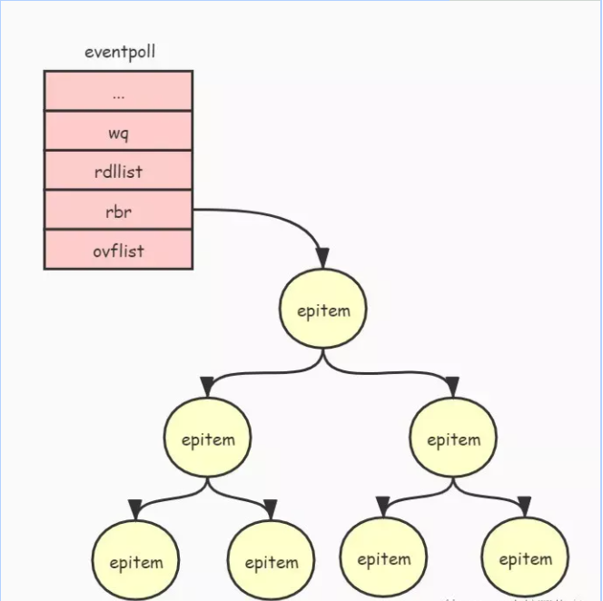

### select和epoll(event poll)的区别:

epoll模型**修改主动轮询为被动通知，当有事件发生时，被动接收通知**。所以epoll模型注册套接字后，主程序可做其他事情，当事件发生时，接收到通知后再去处理。epoll与select的主要区别在于注册的回调函数，epoll的回调函数是把fd加入队列，select是唤醒进程。

epoll的解决:

- 对于第一个缺点，epoll的解决方案在epoll_ctl函数中。每次注册新的事件到epoll句柄中时（在epoll_ctl中指定EPOLL_CTL_ADD），会把所有的fd拷贝进内核，而不是在epoll_wait的时候重复拷贝。epoll保证了每个fd在整个过程中只会拷贝一次。
- 对于第二个缺点，epoll的解决方案不像select或poll一样每次都把current轮流加入fd对应的设备等待队列中，而只在epoll_ctl时把current挂一遍（这一遍必不可少）并为每个fd指定一个回调函数，当设备就绪，唤醒等待队列上的等待者时，就会调用这个回调函数，而这个回调函数会把就绪的fd加入一个就绪链表。epoll_wait的工作实际上就是在这个就绪链表中查看有没有就绪的fd（利用schedule_timeout()实现睡一会，判断一会的效果，和select实现中的第7步是类似的）。
- 对于第三个缺点，epoll没有这个限制，它所支持的FD上限是最大可以打开文件的数目，这个数字一般远大于2048,举个例子,在1GB内存的机器上大约是10万左右，具体数目可以cat /proc/sys/fs/file-max察看,一般来说这个数目和系统内存关系很大。

epoll的优点:

- 没有最大并发连接的限制，能打开的FD的上限远大于1024（1G的内存上能监听约10万个端口）
- 效率提升，不是轮询，不会随着FD数目的增加效率下降。只有活跃可用的FD才会调用callback函数 即Epoll最大的优点就在于它只关心“活跃”的连接，而跟连接总数无关，因此在实际的网络环境中，Epoll的效率就会远远高于select和poll
- 内存拷贝，利用mmap()文件映射内存加速与内核空间的消息传递；即epoll使用mmap减少复制开销。
- epoll通过内核和用户空间共享一块内存来实现的

epoll的触发模式:

**EPOLLLT**和**EPOLLET**两种：

- LT，默认的模式（水平触发） 只要该fd还有数据可读，每次 `epoll_wait` 都会返回它的事件，提醒用户程序去操作，
- ET是“高速”模式（边缘触发）

**EPOLLET**的使用场景:

> a) with nonblocking file descriptors; and
> b) by waiting for an event only after read(2) or write(2) return EAGAIN.

### io_uring的机制

[[译\] Linux 异步 I/O 框架 io_uring：基本原理、程序示例与性能压测（2020） (arthurchiao.art)](https://arthurchiao.art/blog/intro-to-io-uring-zh/#12-非阻塞式-ioselectpollepoll)

包含了两个ring buffer，一个submit queue entry和一个completion queue entry。用户和kernel通过mmap进行交互，通过内存屏障确保正确性

```c++
struct app_sq_ring app_setup_sq_ring(int ring_fd, struct io_uring_params *p)
{
	struct app_sq_ring sqring;
	void *ptr;
   	ptr = mmap(NULL, p→sq_off.array + p→sq_entries * sizeof(__u32),
   	PROT_READ | PROT_WRITE, MAP_SHARED | MAP_POPULATE,
   	ring_fd, IORING_OFF_SQ_RING);
   	sring→head = ptr + p→sq_off.head;
   	sring→tail = ptr + p→sq_off.tail;
   	sring→ring_mask = ptr + p→sq_off.ring_mask;
   	sring→ring_entries = ptr + p→sq_off.ring_entries;
   	sring→flags = ptr + p→sq_off.flags;
   	sring→dropped = ptr + p→sq_off.dropped;
   	sring→array = ptr + p→sq_off.array;
   	return sring;
}
```

实际上io_uring的sqe会有一层indirection，而这层indirection的作用就在于为使得多个sqe可以被映射到application中.

> This indirection could e.g. be used to assign fixed io_uring_sqe entries to operations and only submit them to the queue when needed.

#### 特性

使用简单，Linked mode，File descriptors and buffers can be pre-registered to save mapping/unmapping time

三种工作模式: 1. 中断驱动 2. 轮询模式(low latency模式) 3. 内核轮询

#### System call API

`io_uring_setup(2)`, ` io_uring_register(2)`(*register files or user buffers for asynchronous I/O, File descriptors and buffers can be pre-registered to save mapping/unmapping time*) and `io_uring_enter(2)`

[io_uring.pdf (kernel.dk)](https://kernel.dk/io_uring.pdf)

## 打开文件与解析文件的路径(TODO)

打开文件的过程, 第一步是

## 操作系统调度

**内核中不会发生调度**

短期调度，中期调度，长期调度

抢占式调度，非抢占式调度

FIFO, SJF, STFC, RR, HPF, MLQ, MLFQ

Multi-level Feedback Queue

> 设置了多个队列，赋予每个队列不同的优先级，每个**队列优先级从高到低**，同时**优先级越高时间片越短**；
>
> 新的进程会被放入到第一级队列的末尾，按先来先服务的原则排队等待被调度，如果在第一级队列规定的时间片没运行完成，则将其转入到第二级队列的末尾，以此类推，直至完成；
>
> 当较高优先级的队列为空，才调度较低优先级的队列中的进程运行。如果进程运行时，有新进程进入较高优先级的队列，则停止当前运行的进程并将其移入到原队列末尾，接着让较高优先级的进程运行；

## 磁盘系统调度

先来先服务(First-Come, First-Served, FCFS)

最短寻道时间优先(Shortest Seek First, SSF): 容易产生饥饿

扫描算法(Scan): 中间的磁道响应频率会比其他部分高很多

循环扫描算法(Circular Scan, CSCAN): 只有磁头朝某个特定方向移动时，才处理磁道访问请求，而返回时直接快速移动至最靠边缘的磁道，也就是复位磁头，这个过程是很快的，并且**返回中途不处理任何请求**，该算法的特点，就是**磁道只响应一个方向上的请求**。

LOOK与CLOOK: Scan和CScan都需要移动到最远请求的位置才会返回，LOOK与CLOOK的优化就是仅仅移动到最远请求的位置即可。

## 死锁的检测和解决方法，银行家算法

检测: 资源分配表和线程等待表，来找环

解决方法: 

- 死锁预防

  - 避免互斥访问: (设计代理线程来完成对共享数据的访问与修改)

  - 避免持有并等待: (一次性获取所有资源)

  - 避免资源非抢占: (允许abort)

  - 避免循环等待: (必须按序申请)

- 死锁避免

  银行家算法

  Available, Max, Allocation, Need

  1. During the time of Processing, this algorithm does not permit a process to change its maximum need.
  2. Another disadvantage of this algorithm is that all the processes must know in advance about the maximum resource needs.
  3. This algorithm permits the requests to be provided in constrained time, but for one year which is a fixed period.
